# Movie-Synopsis-Text-Clustering
Movie Synopsis Text Clustering using **K-Means Clustering** and **TF-IDF Vectorizer** and deployment using framework **Flask**.

## About the Project

This project is a major assignment project for the second semester of the **natural language processing** course. The objective of this task is to collect movie synopsis data, perform text clustering on the movie synopsis data into k amount of clusters, and transform it into a web application.

In this project, we use **K-Means Clustering** to perform text clustering and **TF-IDF Vectorizer** as Word Embedding (to convert text data into vectors).

## Technology Used

  * Python
  * Pandas
  * Numpy
  * Matplotlib
  * Seaborn
  * Scikit-learn
  * Wordcloud
  * Requests
  * Flask

## Notebook File
* [synopsis_clustering.ipynb](notebooks/synopsis_clustering.ipynb)

## Workflow

### Data Collection
  - The dataset used in this project is the movie synopsis data obtained using **[The Movie Database (TMDB) API](https://developer.themoviedb.org/reference/intro/getting-started)**. The retrieved data includes movie titles and their synopses only, while genres are not included because they will be predicted in an unsupervised manner by the k-means model during the text clustering process.
  - Despite not including the genres feature, the movie data collected consists of films from various diverse genres. There are a total of **19 genres** across all the movie data collected, and the list of these genres is as follows:
    - Drama
    - Crime
    - Comedy
    - Action
    - Thriller
    - Documentary
    - Adventure
    - Science Fiction
    - Animation
    - Family
    - Romance
    - Mystery
    - Horror
    - Fantasy
    - War
    - Music
    - History
    - Western
    - TV Movie 
  - The quantity of collected data is **8214** movie and synopsis data
  - The dataset is stored in [data/movie_synopsis.csv](data/movie_synopsis.csv)

### Data Preprocessing
  The data preprocessing steps applied to the data include:
  - **Remove missing values**: Delete instances with missing values, such as movies lacking any synopsis text.
  - **Case folding**: Transform all letters into lowercase.
  - Train the **TF-IDF Vectorizer** model.

### Model Training
  - The model is trained using the **K-Means** algorithm to perform clustering on movie synopsis data
  - The training process is conducted using a parameter **k (number of clusters)** set to **14**. Although the original number of genres for movies is 19, this value serves as an initial parameter, which will later be evaluated using the **Elbow Method** and **Silhouette Score**.
  - The trained model is saved to [models/kmeans_model.sav](models/kmeans_model.sav)
  - After the training model is completed, each data point is assigned a label based on its cluster number, and then saved to the file [data/movie_synopsis_labeled.csv](data/movie_synopsis_labeled.csv).
  - **Data distribution based on cluster:**

    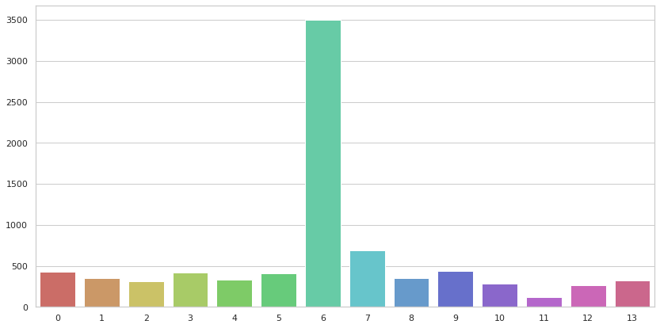

    Note: There's imbalanced data on cluster 6
  - Each cluster has its own feature names, which are words located at the centroid of each cluster, representing the genre of that cluster. Ten feature names are selected for each cluster, and then saved to file [data/feature_names.csv](data/feature_names.csv).
  - **The following are word cloud representations of feature names for each cluster.**
  
    Cluster 0 | Cluster 1 | Cluster 2 | Cluster 3
    :-------------------------:|:-------------------------:|:-------------------------:|:-------------------------:
    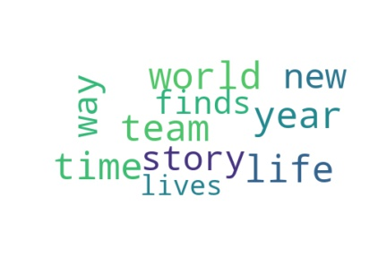  |  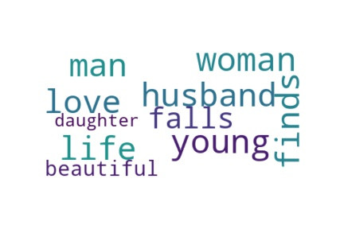  |  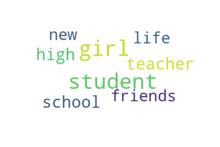  |  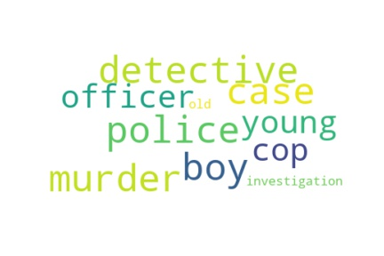
    Cluster 4 | Cluster 5 | Cluster 6 | Cluster 7
    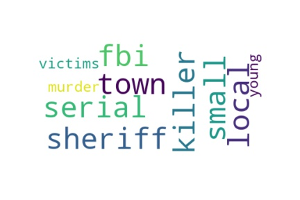  |  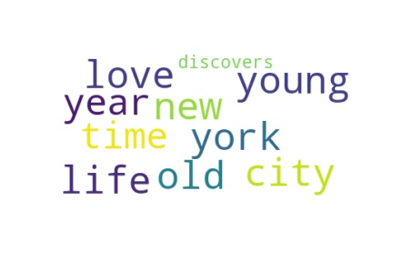  |  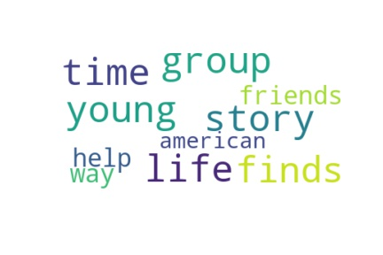  |  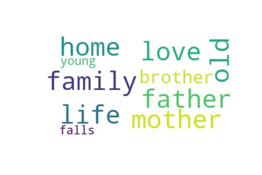
    Cluster 8 | Cluster 9 | Cluster 10 | Cluster 11
    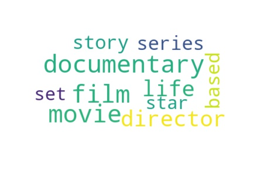  |  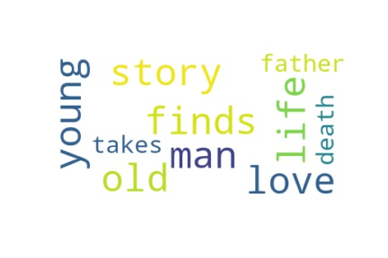  |  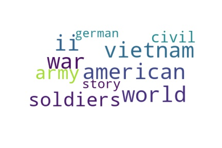  |  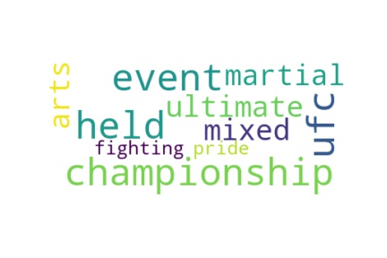
    Cluster 12 | Cluster 13
    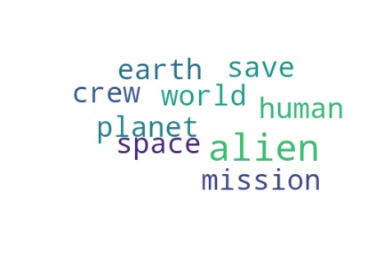  |  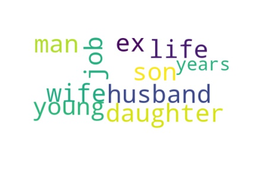
  - For the next steps, the trained model can be used to:
    - **Predict clusters** based on the entered movie synopsis.
    - Provide **movie recommendations based on the entered synopsis** (by calculating cosine similarity between the entered synopsis and the list of movies in the database, and returning movies that are close to the entered synopsis).
    - Provide **movie recommendations based on the entered title** (by obtaining the synopsis from the entered movie title, then performing the same steps as in the previous point, i.e., calculating cosine similarity).
### Model Evaluation
  - **Elbow Method** (SSE):

    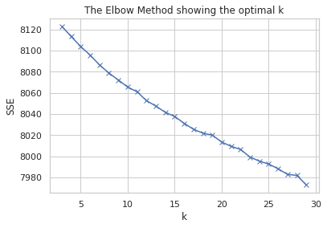
  
  - **Silhouette Score**:
    - 0.004184973145629372
    - **Note**: Silhouette score ranges from -1 to 1, where a higher score indicates better-defined clusters.

### Model Visualization
  - **2D PCA (Principal Component Analysis (PCA))**:

    - 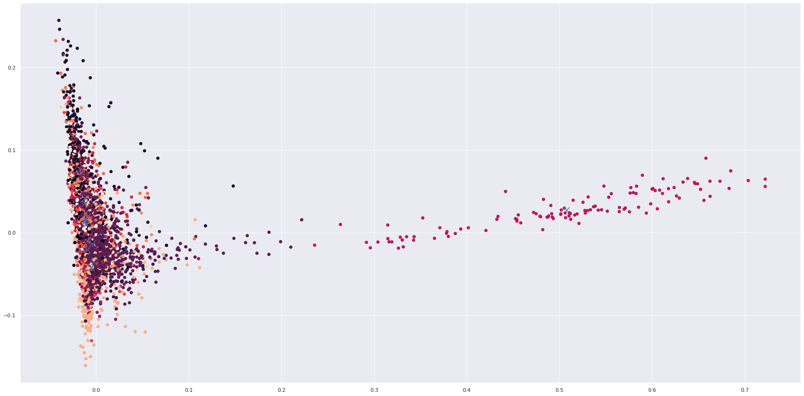
  
  - **3D PCA (Principal Component Analysis (PCA))**:
  
    - 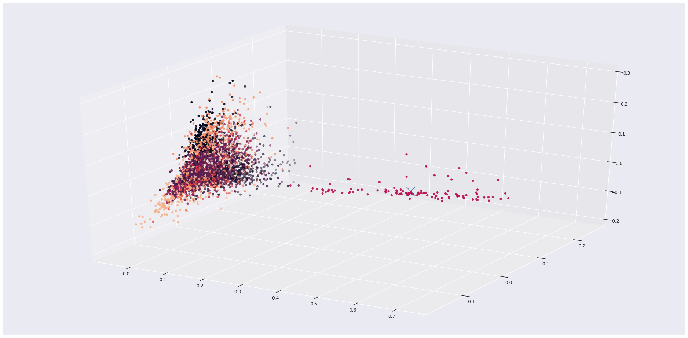

## Web App Screenshots
  
   K-Means Model Training | Clustering Result
   :-------------------------:|:-------------------------:
   .png)  |  .png)
   Feature Names | Data per Clusters
   _2.png) | _2.png)
   Cluster Prediction (By Synopsis) | Cluster Prediction (By Title)
   _2.png) | _2.png)

## Web App Live Demo
 - Web App Movie Synopsis Clustering: [http://xxx.xxx](http://xxx.xxx)

## Web App Features
   - Perform **k-means model training** with input k (number of clusters).
   - Download **K-Means** model
   - Download **data that has been labeled** using trained k-means model
   - The **Elbow Method** evaluation visualization
   - The **Silhouette Score** evaluation
   - The 2 dimension **PCA (Principal Component Analysis)** data visualization
   - The 3 dimension **PCA (Principal Component Analysis)** data visualization
   - **Feature names** list for each cluster
   - **WordCloud** visualization of each Feature Names
   - Preview and download **data per clusters**
   - Cluster prediction + related movie recommendation from input **synopsis**
   - Cluster prediction + related movie recommendation from input **movie title**

## Web App Installation

1. Clone this repo
   ```sh
   git clone https://github.com/LinggarM/Movie-Synopsis-Text-Clustering
   ```
2. Open the repo folder you have cloned in your PC
3. Create a virtual environment
   ```sh
   python -m venv myenv
   ```
4. Activate the virtual environment
   ```sh
   myenv/Scripts/activate or "myenv/Scripts/activate" (Windows)
   myenv/bin/activate (Linux)
   ```
5. Install the requirements/ dependencies
   ```sh
   pip install -r requirements.txt
   ```

## Web App Usage (Tutorials)

1. Open CMD in Repository Folder
2. Run the web app by executing this command :
   ```
   python app.py
   ```
   or :
   ```
   run Flask
   ```
3. Open the given URL
   ```
   http://127.0.0.1:5000/
   ```
4. Input **cluster number (k)**, and click "train model" to start the training process. Wait for a while until the training process finished, and you will be redirected to **Clustering result** page with the information of the finished clustering model training process.

## Publication
* [Aplikasi Clustering Film Berdasarkan Sinopsisnya.pdf](docs/Laporan_PBA_Kelompok%205.pdf)

## Contributors
* [Linggar Maretva Cendani](https://github.com/LinggarM) - [linggarmc@gmail.com](mailto:linggarmc@gmail.com)

## License
This project is licensed under the MIT License - see the [LICENSE](LICENSE) file for details

## Acknowledgments
* [Material Dashboard - v2.1.2](https://www.creative-tim.com/product/material-dashboard) for HTML templates
